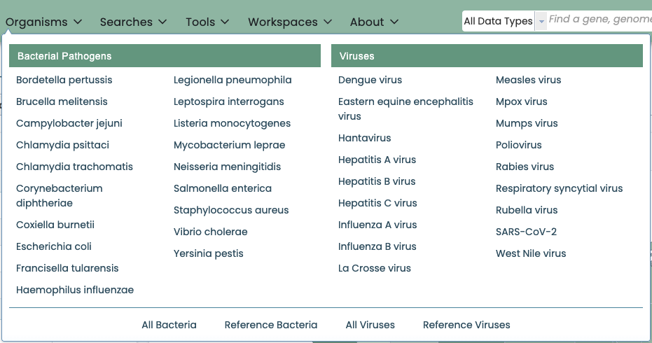

Organisms and Data Types
========================
The top-level Organisms Menu provides direct access to genus-level data for bacteria and viruses corresponding to `NIAID's Priority Pathogens <https://www.niaid.nih.gov/research/emerging-infectious-diseases-pathogens>`_. It also provides direct access to summary-level data for all bacteria, viruses, archaea, phages, and eukaryotic hosts on the platform.

Clicking on one of the menu items will display the corresponding taxon-level Overview page. From there, data are accessible via tabs at the taxon, genome/strain, and feature (gene, protein) levels, as described in the Quick Reference Guides below. 

Taxon-Level Data
----------------

.. toctree::
   :maxdepth: 1

   organisms_taxon/taxonomy
   organisms_taxon/genomes
   organisms_taxon/amr_phenotypes
   organisms_taxon/features
   organisms_taxon/specialty_genes

Genome/Strain-Level Data
------------------------

.. toctree::
   :maxdepth: 1

   organisms_genome/overview
   organisms_genome/genome_browser
   organisms_genome/circular_genome_viewer

Gene/Protein-Level Data
-----------------------

.. toctree::
   :maxdepth: 1

   organisms_gene/overview
   organisms_gene/genome_browser
   organisms_gene/compare_region_viewer
   organisms_gene/transcriptomics
   organisms_gene/correlated_genes
   organisms_gene/interactions