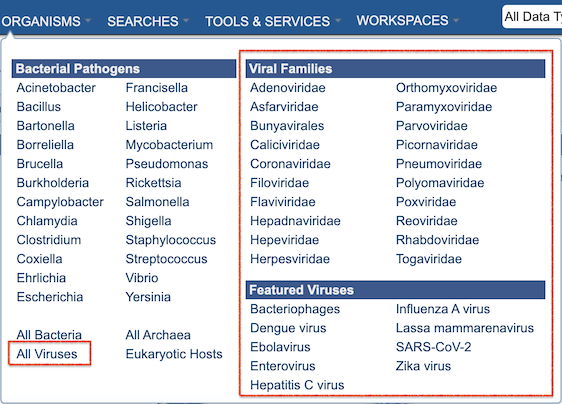
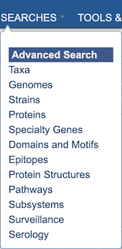
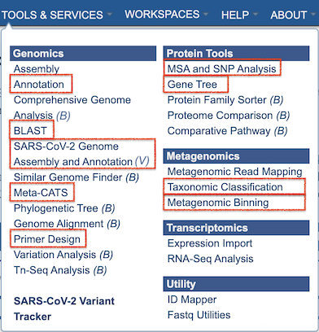
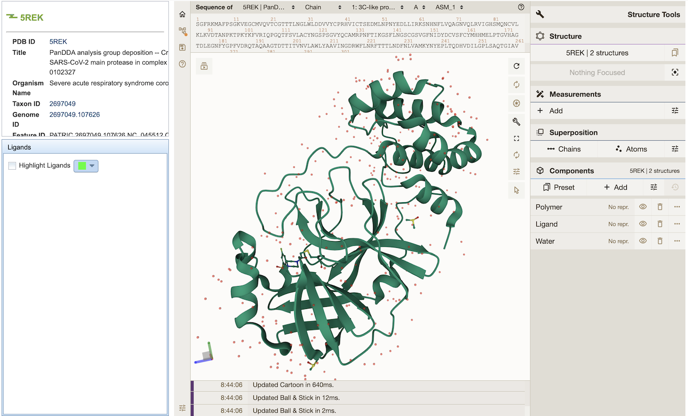

# Data and Functionality Overview

The platform provides integrated bacterial and viral data, tools, and features. Users can perform searches, analyses, and workspace operations across a comprehensive set of data types. In summary, the available capabilities include the following:

* [Viral Genomes and Other Data](/system_documentation/data)
* [Specialized Searches](#searches)
* [Tools and Services](#tools)
* [Data Visualizations](#visualizations)

Additional details are presented below. 

(data)=
## Data 

### Organisms

The platform includes bacterial pathogens and other bacterial and archaeal species, as well as viral genomes and other data for influenza and other pathogenic viruses. The ORGANISMS top menu reflects these options (see below). Website pages, searches, services, and tools can also access, display, and use these data. 

Eukaryotic host genomes are included as well. 

### Genomes

Bacterial genomes (~500K annotated bacterial genomes and associated data) are complemented with a comparable volume of **viral genomes** (~5M viral genomes and associated data). Many of the viral genomes have **additional metadata attributes**, which have be been added to the overall set of genome metadata fields. A summary of available genome metadata fields and how to access them is available in the [Genome Metadata Quick Reference Guide](/quick_references/organisms_taxon/genome_metadata).

In response to the COVID epidemic, a custom resource for tracking associated genomic variants and lineages of concern (VoCs/LoCs) has been created and is available at [SARS-CoV-2 Variants and Lineages of Concern](https://bv-brc.org/view/VariantLineage/#view_tab=overview).

### Other Data

Along with the viral genomes, corresponding **genes/proteins**, **protein domains and motifs**, and **protein structure** data have been integrated with the bacterial data.

The viral data brings with it two unique data types: **surveillance** and **serology**. Information regarding these data types is available from the following user documentation:

* [Surveillance Data Quick Reference Guide](/quick_references/organisms_taxon/surveillance_data)

* [Serology Data Quick Reference Guide](/quick_references/organisms_taxon/serology_data)

(searches)=
## Searches

The Global Search is augmented with specialized **Advanced Searches** for each of the major data types including Taxa, Genomes, Strains, Proteins, Specialty Genes, Domains and Motifs, Epitopes, Protein Structures, Pathways, Surveillance data, and Serology data.  These searches are available from the **SEARCHES** top menu. 

(tools)=
## Tools and Services

A range of analysis tools is available for both bacterial and viral data. Where practical, complementary tools have been merged into one, or extended to support additional data types. These are available from the TOOLS & SERVICES TOP menu, shown below. The letter "B" or "V" beside the service name indicates that the service is only available for bacterial *(B)* or viral *(V)* data.

Summaries for the tools and services are below, with links to corresponding quick reference guides and tutorials: 

**Genome Annotation Service** - supports annotation of bacterial and viral genomes ([Quick Reference Guide](/quick_references/services/genome_annotation_service),  [Tutorial](/tutorial/genome_annotation/genome_annotation)). 

**BLAST (Homology Search) Service** - includes viral sequences and short sequence search ([Quick Reference Guide](/quick_references/services/blast), [Tutorial](/tutorial/blast/blast)).

**SARS-CoV-2 Genome Assembly and Annotation Service** - supports assembly and annotation of SARS-CoV-2 genomes from sequence reads. ([Quick Reference Guide](/quick_references/services/sars_cov_2_assembly_annotation_service), [Tutorial](/tutorial/sars_cov_2_assembly_annotation/sars_cov_2_assembly_annotation)).

**Metadata-driven Comparative Analysis Tool (Meta-CATS)** - looks for positions that significantly differ between user-defined groups of sequences ([Quick Reference Guide](/quick_references/services/metacats), [Tutorial](/tutorial/metacats/metacats)).

**Primer Design Service** - designs primers from a given input sequence under a variety of temperature, size, and concentration constraints ([Quick Reference Guide](/quick_references/services/primer_design_service), [Tutorial](/tutorial/primer_design/primer_design)).

**MSA and SNP Analysis Service** - constructs a multiple sequence analysis (MSA) and computes single nucleotide polymorphisms (SNPs) for a given set of nucleotide or protein sequences ([Quick Reference Guide](/quick_references/services/msa_snp_variation_service), [Tutorial](/tutorial/msa_snp_variation/msa_snp_variation)).

**Gene Tree Service** - constructs custom phylogenetic trees built from user-selected genomes, genes, or proteins ([Quick Reference Guide](/quick_references/services/genetree), [Tutorial](/tutorial/genetree/genetree)).

**Taxonomic Classification** - includes viruses ([Quick Reference Guide](/quick_references/services/taxonomic_classification_service), [Tutorial](/tutorial/taxonomic_classification/taxonomic_classification)).

**Metagenomic Binning** - includes viruses ([Quick Reference Guide](/quick_references/services/metagenomic_binning_service), [Tutorial](/tutorial/metagenomic_binning/metagenomic_binning)).

(visualizations)=
## Visualization Tools

The *archaeopterix.js Phylogenetic Tree Viewer* is integrated and displays trees generated by the **Phylogenetic Gene Tree Service** [Quick Reference Guide](/quick_references/services/genetree), [Tutorial](/tutorial/genetree/genetree).

A *3-D Protein Structure Viewer* is integrated that displays structures for bacterial and viral proteins, where available. See [Protein Structure Data Quick Reference](/quick_references/organisms_taxon/protein_structures) for more information.  

