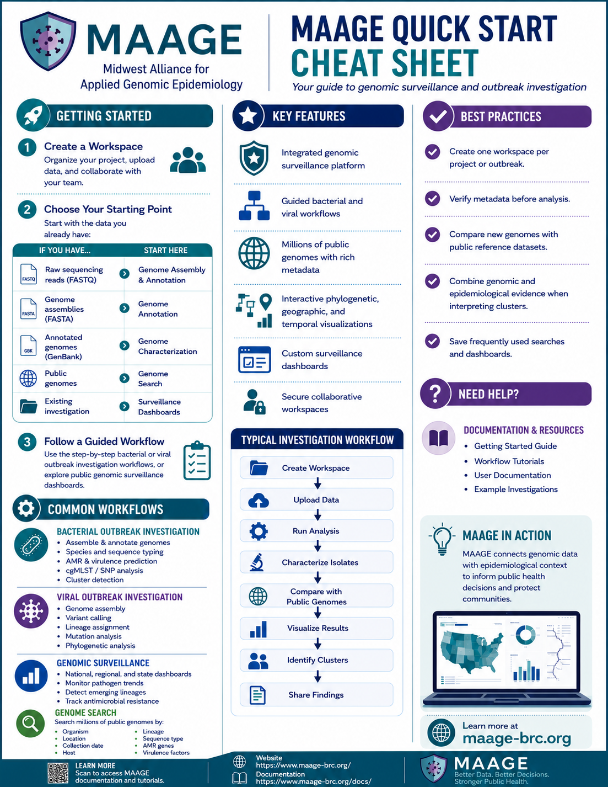

Quick Start
===========

Welcome to MAAGE! The The Midwest Alliance for Applied Genomic Epidemiology (MAAGE) provides an integrated platform for genomic surveillance, outbreak investigation, and comparative genomics. Use this Quick Start Cheat Sheet to familiarize yourself with the platform, discover its core features, and identify the workflow that best matches your data and investigation goals.

Download the Quick Start Guide PDF:
:download:`Download the MAAGE User Guide (PDF) <./maage_quick_start.pdf>`

