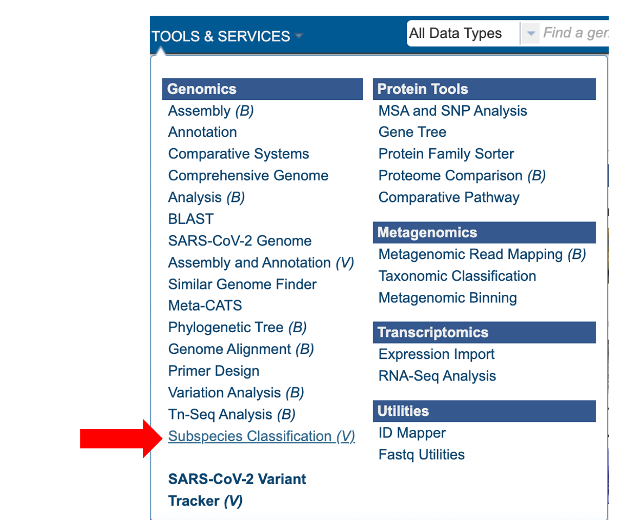
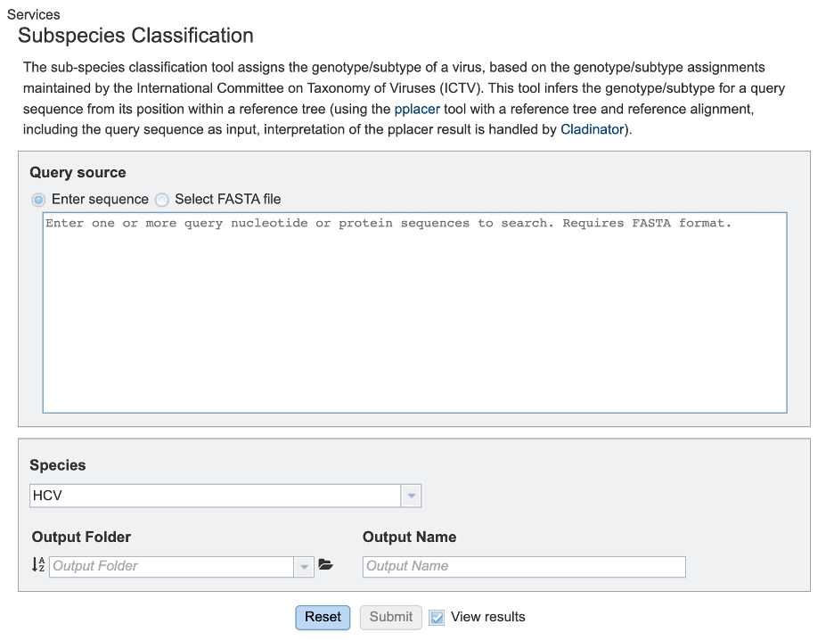
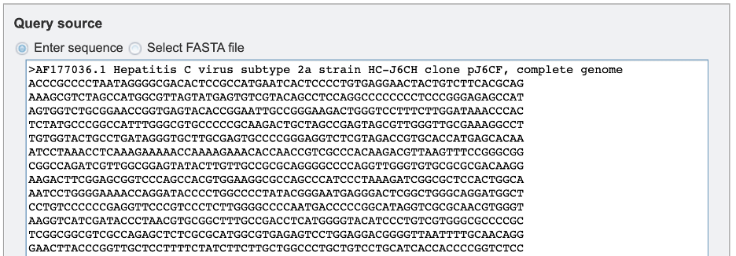
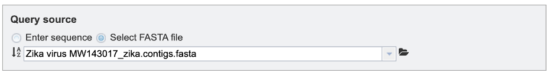

# Subspecies Classification Service

*Revised: 11/7/2022*

## Overview

## Locating the Subspecies Classification Service

1\. At the top of any page, find the **SERVICES** tab and then click on **Subspecies Classification Service**.
 

2\. This will open the subspecies classification landing page.
 

## Specifying classification parameters

1\. Users will need to first select the input file method for the classification service. If “Enter sequence” is selected, users can paste in their sequence(s) (FASTA format).
 

If the “Select FASTA file” option is checked, users will need to either select a saved FASTA file from their workbench or upload their own file.
