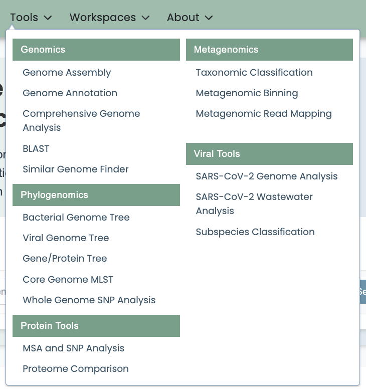
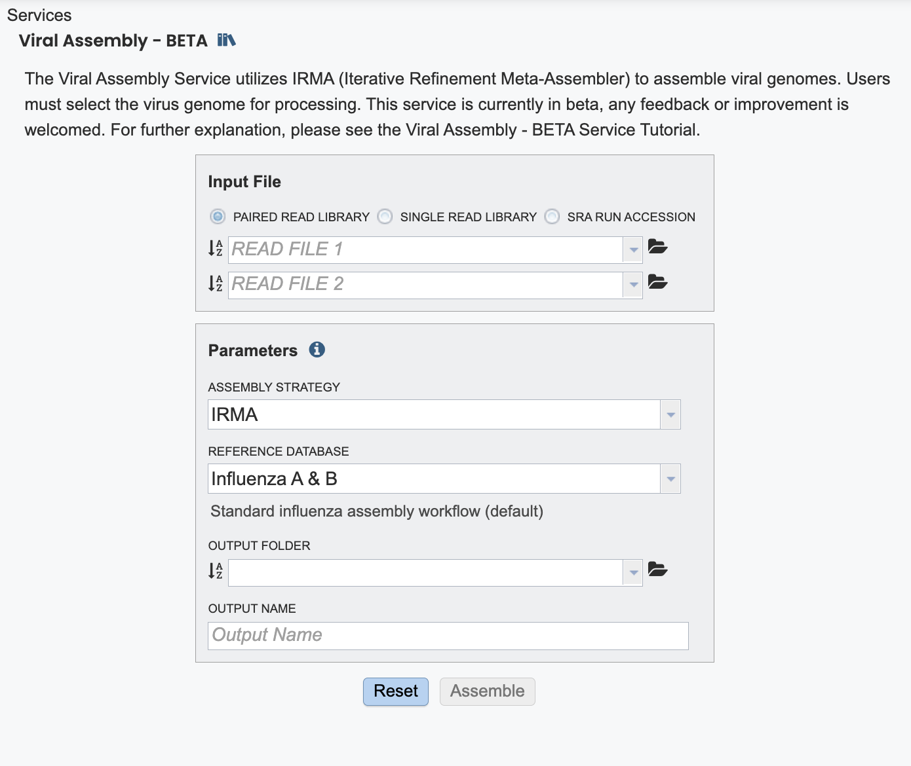

# Analyzing Viral Genome Assembly Using Platform Tools Tutorial

#### Viral Genome Assembly Service

#### Overview

1\. The Viral Genome Assembly Service allows users to assemble viral genomes utilzing IRMA(1)(currently the platform supports Influenza). Once the assembly process has started by clicking the Assemble button, the genome is queued as a "job" for the Assembly Service to process, and will increment the count in the Jobs information box on the bottom right of the page. Once the assembly job has successfully completed, the output file will appear in the workspace.\
This service and tutorial are currently in beta- and will be updated to reflect the tools development.\
A genome assembly is the sequence produced after chromosomes from the organism have been fragmented, those fragments have been sequenced, and the resulting sequences have been put back together. This is currently needed as DNA sequencing technology cannot read whole genomes in one go, but rather can read small pieces of between 20 and 30,000 bases, depending on the technology used. Typically, the short fragments, called reads, result from shotgun (random) sequencing of genomic DNA.

De novo sequence assemblers are a type of program that assembles short nucleotide sequences into longer ones without the use of a reference genome. These are commonly used in bioinformatic studies to assemble genomes or transcriptomes.

What follows is a tutorial showing how to submit reads for assembly and selecting parameters for the assembly algorithm.

The Viral Genome Assembly service uses an open source, third-part bioinformatics program- IRMA developed by the CDC. IRMA provides a robust next-generation sequencing assembly solution that is adapted to the needs and characteristics of viral genomes. More information about IRMA (<https://bmcgenomics.biomedcentral.com/articles/10.1186/s12864-016-3030-6>) can be found here IRMA  and <https://wonder.cdc.gov/amd/flu/irma/irma.html> pages.

#### Using the Viral Genome Assembly Service

1\. Locate the Tools option on the top navigation bar.

2\.	From the tools dropdown menu, navigate to Viral Tools and select Taxonomic Classification. 

3\. Using the Viral Genome Assembly Service\
The **Viral Assembly** submenu option under the **Services** main menu (Viral Tools category) opens the Viral Genome Assembly input form, shown below. *Note: You must be logged into the platform to use this service.*

4\. Click "Viral Assembly"

5\. Click the radio dials to select your input type.

6\. For this tutorial, select SRA Run Accession and enter: SRR31821206

### Input File selections

**Paired read library**

**Read File 1 & 2:** Many paired read libraries are given as file pairs, with each file containing half of each read pair. Paired read files are expected to be sorted such that each read in a pair occurs in the same Nth position as its mate in their respective files. These files are specified as READ FILE 1 and READ FILE 2. For a given file pair, the selection of which file is READ 1 and which is READ 2 does not matter.

### Single read library

**Read File:** The fastq file containing the reads.

### SRA run accession

Allows direct upload of read files from the [NCBI Sequence Read Archive](https://www.ncbi.nlm.nih.gov/sra) to the Assembly Service. Entering the SRR accession number and clicking the arrow will add the file to the selected libraries box for use in the assembly.

## Files accepted by the Assembly Service

The assembly service accepts read files in either fastq, fasta, fastq.gz, or fasta.gz format.

**FASTQ** is a text-based format for storing both a nucleotide sequence and its corresponding quality scores. Both the sequence letter and quality score are each encoded with a single ASCII character. A FASTQ file normally uses four lines per sequence:

- Line 1 begins with a ‘@’ character and is followed by a sequence identifier and an optional description (like a FASTA title line).
- Line 2 is the raw sequence letters.
- Line 3 begins with a ‘+’ character and is optionally followed by the same sequence identifier (and any description) again.
- Line 4 encodes the quality values for the sequence in Line 2 and must contain the same number of symbols as letters in the sequence.

**FASTA** is a text-based format for representing either nucleotide sequences or amino acid (protein) sequences using single-letter codes. The format allows for sequence names and comments to precede the sequences. A **FASTA read file** has two parts:

- Line 1 begins with a ‘&gt;’.  Everything from the beginning ‘&gt;’ to the first whitespace is considered the sequence identifier. Everything after that is considered the sequence description (this can be metadata, machine serial number, read orientation, etc.), all in a single line.
- Line 2 has the sequence, which can span multiple lines depending on the length.

## Parameters

**Assembly Strategy:**

- We offer both reference guided assembly and the tool IRMA. The directions below are for IRMA.

6\. We offer a varity of reference databases. Review the options. For this tutorial, Click "Influenza A & B". 

7\. An output folder must be selected for the assembly job.  Typing the name of the folder in the text box underneath the words **Output Folder** will show a drop-down box that shows close hits to the name, and clicking on the arrow at the end of the box will open a drop-down box that shows the most recently created folders.  To find a previously created folder, or to create a new one, click on the **Folder** icon at the end of the text box.  This will open a pop-up window that shows all the previously created folders.

9\. Select your output directory. Take caution to consider your file organization system and a thoughtful output name as you may return to this directory at a later date.  

10\. If all webpage fields are correct the "Assemble" box will change from gray to blue. Click "Assemble" to submit yoru job.

11\. A message will appear at the bottom of the page, indicating that the submitted job has entered the queue.

12\. Click on the **Jobs** box at the bottom right of any page.

13\. ## Viewing and Interpreting the Assembly Job Results

1. On the jobs page, click on the row that has the assembly of interest. This will populate the vertical green bar on the right with possible downstream steps, which include viewing the results of the job, or reporting an issue that was experienced (like a job failure).  Click on the **View** icon.\
   \
   Double-click your completed job to view result.

14\. This is your job results page. All of the files beow were produced during the pipeline run.

The information about the job submission can be seen in the table at the top of the results page.  To see all the parameters that were selected when the job was submitted, click on the **Parameters** row. This will show the information on what was selected when the job was originally submitted.\

15\. Click on the report eyeball icon in the upper right hand corner to review the job report.

16\. The Genome Assembly report contains valuable information about the assembly, including the number of contigs. Clicking on the row that contains the number of contigs, depth and coverage.  **AssemblyReport.html** will highlight it in blue and populate the action bar with possible downstream steps.  Click on the **View** icon.

17\. A fasta file is created for each segment labeled acorrding ot the segment name. Download with the "download" icon on the green bar.\
\
Theese contig files can be used in downstream services.  Note that the file, which can be clicked on from the Jobs page, has the type matched as “contigs” in the information panel beyond the green bar.  The contig file can be used as is in the platform or downloaded for use in other resources or pipelines.

18\. Click ".irma_test_SRR31821206"

19\. Click "All statistics are based on contigs of size &gt;= 300 bp, unless otherwise noted (e.g., "# contigs (&gt;= 0 bp)" and "Total length (&gt;= 0 bp)" include ..."

20\. Click "Quast HTML Report"

21\. Scrolling down will reveal a **Quast report**, which is also included in the Genome Assembly report. Quast is a quality assessment tool for evaluating and comparing genome assemblies, and shows statistics of the contigs generated in the assembly.

22\. Double-click "quast"

23\. Click "GC_content_plot.pdf" Review the GC content of your samples.

24\. The Viral Assembly Service generates several files that are deposited in the Private Workspace in the designated Output Folder. These include

- **assembly_report.html** - Web-viewable report of the assembly including information about the submitted reads and assembly process used.
- **quast** - Folder including all of the standard outputs of quast.
- **IRMA** - Folder including the VCF, bam and bam.bai files generated by IRMA. It also includes sub folders for amended)consensus, figures, intermediate, log, matrices, secondary and tables.
- **.fasta** - All of the associated fasta files for the assembly, including by segment and cummulative.

### Action buttons

After selecting one of the output files by clicking it, a set of options becomes available in the vertical green Action Bar on the right side of the table.  These include:

- **Hide/Show:** Toggles (hides) the right-hand side Details Pane.
- **Guide:** Link to the corresponding Quick Reference Guide.
- **Download:**  Downloads the selected item.
- **View:** Displays the content of the file, typically as plain text or rendered html, depending on filetype.
- **Delete:** Deletes the file.
- **Rename:** Allows renaming of the file.
- **Copy:** Copies the selected items to the clipboard.
- **Move:** Allows moving of the file to another folder.
- **Edit Type:** Allows changing of the type of the file in terms of how the platform interprets the content and uses it in other services or parts of the website.  Allowable types include unspecified, contigs, nwk, reads, differential expression input data, and differential expression input metadata.

25\. References\
Gurevich, A., et al., QUAST: quality assessment tool for genome assemblies. Bioinformatics, 2013. 29(8): p. 1072-1075.\
Shepard, S.S., Meno, S., Bahl, J. et al. Viral deep sequencing needs an adaptive approach: IRMA, the iterative refinement meta-assembler. BMC Genomics 17, 708 (2016). <https://doi.org/10.1186/s12864-016-3030-6>
#### [Made with Scribe](https://scribehow.com/shared/Analyzing_Viral_Genome_Assembly_Using_BV-BRC_Tools_Tutorial__A-fXajgCQi-bD-Wzs4rmXw)